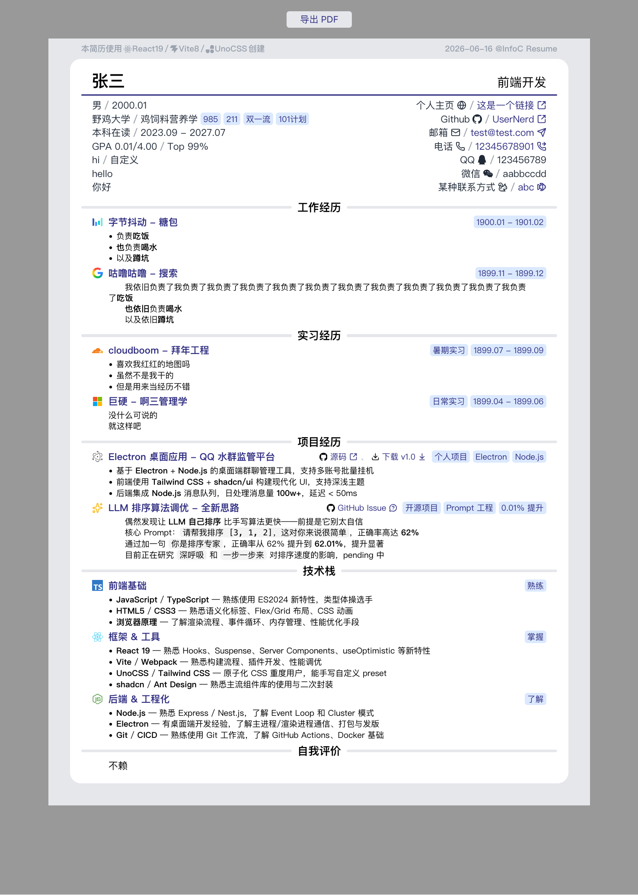

# Infoc Resume

一页纸简历生成器 —— 基于 React + Vite + UnoCSS，直接打印为 PDF。



## 特性

- **配置驱动** — 所有简历内容都在 `src/config.ts` 里配置，零代码上手
- **原子化 CSS** — 基于 UnoCSS，体积小、速度快
- **打印即 PDF** — 浏览器打印直接导出 PDF，支持背景图形
- **彩色图标** — 内置多种技术栈彩色图标 + 单色图标（可自定义颜色）
- **富文本支持** — `**加粗**`、`` `代码` `` 等 Markdown 风格语法

## 快速开始

1. 环境要求
   - Node.js >= 18
   - pnpm >= 6
2. 安装依赖
    - `pnpm setup`
3. 启动开发服务器
    - `pnpm dev`
启动后访问 <http://localhost:5173> 即可预览。

## 如何修改

### 修改简历内容

所有内容都在 **`src/config.ts`** 中，直接修改对应字段即可。

```ts
export default defineConfig({
  personalInfo: {
    basicInfo: {
      name: '你的名字',
      exceptPosition: '求职岗位',
      // ...
    },
    contactInfo: {
      // 联系方式
    },
  },
  content: [
    // 各个板块（工作经历、项目经历、技术栈...）
  ],
});
```

### 富文本语法

在 `contentList` 等文本字段中可以使用：

| 语法         | 效果     |
|------------|--------|
| `**文字**`   | **加粗** |
| `` `代码` `` | `行内代码` |

### 图标配置

所有图标字段都支持两种写法：

- 字符串形式（用默认颜色）
```
{ titleIconPrefix: 'github' }
```
- 对象形式（自定义颜色）
```
{ titleIconPrefix: { name: 'react', color: '#61dafb' } }
```

内置图标：`react` / `vite` / `unocss` / `github` / `bytedance` / `qq` / `wechat` 等。

也可以用 `lucide-xxx` 前缀调用 [Lucide 图标](https://lucide.dev/icons)，比如 `lucide-mail`、`lucide-github`。

你可以自行导入图标，推荐使用 [Simple Icons](https://simpleicons.org/)（单色图标）、[theSVG](https://thesvg.org/)（彩色图标）

### 导出 PDF

1. 点击页面上的 **「导出 PDF」** 按钮（或按 `Cmd/Ctrl + P`）
2. 打印机选择 **「另存为 PDF」**
3. 勾选下方的 **「打印背景」**
4. 点击 **「打印」** 即可下载 PDF 文件

## 给 LLM 的 Prompt

如果你用 AI 帮你改代码，可以直接复制下面的 prompt：

### 添加一个新的图标

```
帮我在 src/assets/icons/ 下新增一个 XxxIcon.tsx 图标组件，仿照已有的图标格式（FC<SVGProps<SVGSVGElement>>，fill="currentColor"），并在 src/components/icon/index.tsx 中注册。
图标名：xxx，路径 xxx
```

### 修改简历配置

```
帮我在 src/config.ts 中添加一条项目经历：
- 标题：项目名
- 图标：xxx（带颜色 #xxx）
- 标签：['xxx', 'xxx']
- 链接列表：...
- 内容：...
注意保持现有风格，使用 renderText 支持的富文本语法。
```

### 新增一个简历板块

```
帮我在 src/config.ts 的 content 数组中新增一个 section，sectionTitle 为 "xxx"，类型为 itemList 形式，包含 2-3 个示例项。
```

## 项目结构

```
src/
├── assets/
│   ├── icons/          # 自定义 SVG 图标
│   └── css/            # 全局样式
├── components/         # 通用组件
├── sections/           # 简历各板块组件
├── utils/              # 工具函数
├── view/               # 页面入口
└── config.ts           # 简历配置（大概率只改这个）
```

## 协议

**完全开源，随便用。**

本项目采用 **MIT License** + **WTFPL License** 双协议，你可以：

- 商用
- 修改
- 分发
- 私用
- 去掉作者名
- 用来干啥都行
